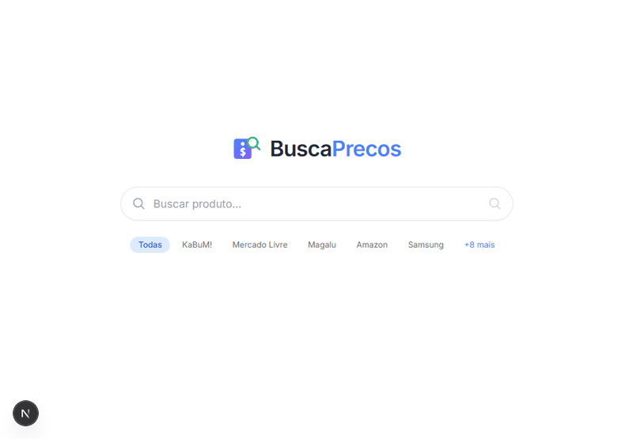

---

  
  
  
  
  
  
  

## BuscaPrecos 🔎

<strong>Comparador de precos de eletrônicos em tempo real</strong>, que busca simultaneamente em 13+ lojas brasileiras com resultados progressivos via streaming

## O que é?

O **BuscaPrecos** é um simples estudo de motor de busca de precos que consulta multiplas lojas de eletrônicos ao mesmo tempo. Os resultados chegam em tempo real conforme cada loja responde, sem esperar todas terminarem.

## Problema que resolve 🤷🏻‍♂️

Comparar precos manualmente em dezenas de sites e demorado. O BuscaPrecos faz isso em segundos.

## Funcionalidades

**13 lojas simultâneas** — KaBuM!, Mercado Livre, Amazon, Magalu, Samsung e mais

**Streaming em tempo real** — resultados aparecem conforme cada loja responde (SSE)

**Autocomplete** — sugestões inteligentes para eletrônicos, hardware, celulares

**Filtros** — por preço, loja, estoque, desconto

**Ordenacao** — menor preço, maior preço, relevancia

**Selecao de lojas** — buscar apenas nas lojas que quiser

**Historico de precos** — salvo em SQLite

**Cache** — resultados ficam em cache por 15 minutos

**Responsivo** — desktop e mobile

## Lojas Suportadas

  <table style="width:100%; min-width:100%; border-collapse:collapse;" border="1">
    <thead>
      <tr>
        <th>Loja</th>
        <th>Método</th>
        <th>Velocidade</th>
      </tr>
    </thead>
    <tbody>
      <tr>
        <td><strong>KaBuM!</strong></td>
        <td>API</td>
        <td>~2s</td>
      </tr>
      <tr>
        <td><strong>Mercado Livre</strong></td>
        <td>API</td>
        <td>~3s</td>
      </tr>
      <tr>
        <td><strong>Magazine Luiza</strong></td>
        <td>API</td>
        <td>~3s</td>
      </tr>
      <tr>
        <td><strong>Amazon Brasil</strong></td>
        <td>Fetch + HTML</td>
        <td>~4s</td>
      </tr>
      <tr>
        <td><strong>Samsung Store</strong></td>
        <td>API VTEX</td>
        <td>~3s</td>
      </tr>
      <tr>
        <td><strong>Havan</strong></td>
        <td>Fetch + HTML</td>
        <td>~5s</td>
      </tr>
      <tr>
        <td><strong>iByte</strong></td>
        <td>API VTEX</td>
        <td>~3s</td>
      </tr>
      <tr>
        <td><strong>Dell Brasil</strong></td>
        <td>Puppeteer</td>
        <td>~15s</td>
      </tr>
      <tr>
        <td><strong>TerabyteShop</strong></td>
        <td>Puppeteer</td>
        <td>~12s</td>
      </tr>
      <tr>
        <td><strong>Pichau</strong></td>
        <td>Puppeteer</td>
        <td>~12s</td>
      </tr>
      <tr>
        <td><strong>Fast Shop</strong></td>
        <td>Puppeteer</td>
        <td>~15s</td>
      </tr>
      <tr>
        <td><strong>ASUS Store</strong></td>
        <td>Puppeteer</td>
        <td>~20s</td>
      </tr>
      <tr>
        <td><strong>Leroy Merlin</strong></td>
        <td>Puppeteer</td>
        <td>~18s</td>
      </tr>
    </tbody>
  </table>

## 🎥 Demonstração

  

## Screenshot API

## Licença
MIT
